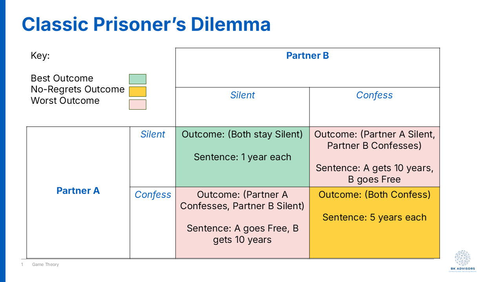
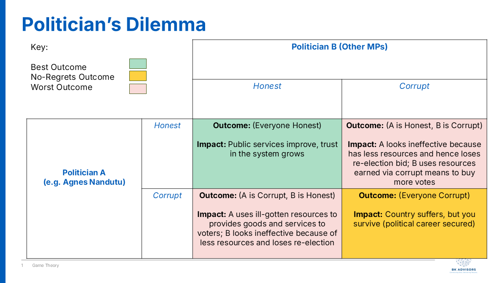

Agnes Nandutu's career as a journalist was as respected and successful as they come.

She hosted and voiced over a popular TV segment called "Point Blank" that poked fun at Ugandan politicians with the kind of satire and comedic timing that made us, her loyal audience, tear up with laughter. In the early 2010s, she was the rare kind of public figure we trusted to speak truth to power and make us laugh along the way.

In 2021, she decided to turn the popularity into a run for Parliament, representing her home district of Bududa, and she won!

But not only that, President Museveni added some icing on her cake and appointed her State Minister for Karamoja affairs, responsible for one of Uganda's poorest regions.

She was truly on the rise.

Then in 2023, a corruption scandal broke. Roofing iron sheets, meant to build homes for the poor in Karamoja, had been misappropriated.

At the center of it all: Agnes. The once honest journalist admitted her involvement.

The question many of us asked was: How does someone go from exposing politicians on TV to practicing those same vices, once in office?

The rapper Ice-T said it best - "Don't hate the playa, hate the game", which still applies in this case. The game of journalism is different from the game of politics.

And the key to understanding corrupt behavior in politics does not lie solely in the individual. It primarily lies in the system of incentives in the political arena.

Coincidentally, one of the tools that we can use to analyze the decision making process of politicians is called, "Game Theory".

## What is Game Theory?

At its core, Game Theory is the study of strategic decision-making. Think of it like a game of chess. Your best move depends entirely on the move you expect your opponent to make. It's a framework for analyzing situations where the outcome of your choices depends on the choices of others.

In any "game," players want to maximize their payoffs, whether that payoff is money, power, or simply winning. Game Theory helps us understand why a rational person might make a seemingly irrational or immoral choice, simply because the rules and the other players' expected actions make it the most logical move for them personally.

One of the most famous concepts in Game Theory is the Prisoner's Dilemma, and it perfectly illustrates the political trap Agnes Nandutu and others find themselves in.

### The prisoner's dilemma

The classic Prisoner's Dilemma goes like this: Two partners in crime are arrested and held in separate cells, with no way to communicate. The prosecutor offers each of them the same deal:

- If you confess and implicate your partner, and your partner stays silent, you go free. Your partner gets 10 years in prison.
- If you both stay silent, you both get a minor charge, serving only 1 year.
- If you both confess and implicate each other, you both get 5 years.

What would you do?

From a collective standpoint, the best outcome is for both to stay silent (cooperate with each other) and serve only one year. But from an *individual* standpoint, that's a huge risk. What if your partner rats you out to save themselves? Then you're the idiot who gets 10 years.

No matter what your partner does, confessing (or "snitching") always seems like the safer bet for you personally. If they stay silent, you go free. If they confess, you get 5 years instead of 10. The result? Both prisoners, acting in their own rational self-interest, confess and end up with a worse outcome than if they had just trusted each other.

This is the game many politicians are forced to play.

### The politician's dilemma

Let's reframe the Prisoner's Dilemma for a Ugandan politician. The choices aren't about confessing or staying silent; they are about being Honest or being Corrupt.

- **Be Honest:** You refuse to divert public funds, follow every procurement rule, and wait for the slow-moving official government programs to (maybe) reach your constituents.
- **Be Corrupt:** You divert resources (like those iron sheets) to directly benefit your voters, support networks, and personal coffers.

Now, let's look at the payoffs in a political system with weak institutions and high public expectations:

1.  **You are Honest, but other politicians are Corrupt:** This is the "idiot's payoff". While you wait for official channels, other MPs are delivering tangible goods to *their* people. They are building schools, paying funeral expenses, and handing out cash. At the next election, your constituents see you as ineffective and useless. You followed the rules, but you lost the game. You are voted out.

2.  **You are Corrupt, and other politicians are Honest:** This is the jackpot. You gain a massive advantage, looking like a hero who "delivers" for your people while others seem slow and bureaucratic. Your political survival is almost guaranteed.

3.  **Everyone is Honest:** This would be the ideal outcome for the country. Public services improve for everyone, and trust in the government grows. However, for an individual politician, it means you can't outshine your rivals with patronage.

4.  **Everyone is Corrupt:** This is the political reality in many places. The country as a whole suffers, but for the individual politician, it's the rational choice for survival. You get the resources to satisfy immediate constituent demands, secure your position, and compete with your peers who are doing the exact same thing. The risk of getting caught is low, and the risk of being an honest but "ineffective" politician is career suicide.

I like to think of the old Agnes Nandutu, the journalist, as a "match commentator" of sorts. Her incentive was to expose the fouls in the game. But when she became a player on the field, a MP, the incentives flipped entirely. Her survival as a politician, her ability to meet the demands of her constituents in Bududa, and her standing among her peers all depended on playing the game by its unwritten, dare I say - corrupt rules.

Her choice to divert those iron sheets wasn't necessarily a sudden moral collapse. It was a calculated move in a system where the incentives overwhelmingly reward corruption and punish honesty. To fix the problem, we can't just focus on the morality of the players - that's an attribution fallacy. We have to change the rules of the game itself - by strengthening institutions, demanding accountability, and rewarding transparency, thereby making honesty the truly rational choice.
