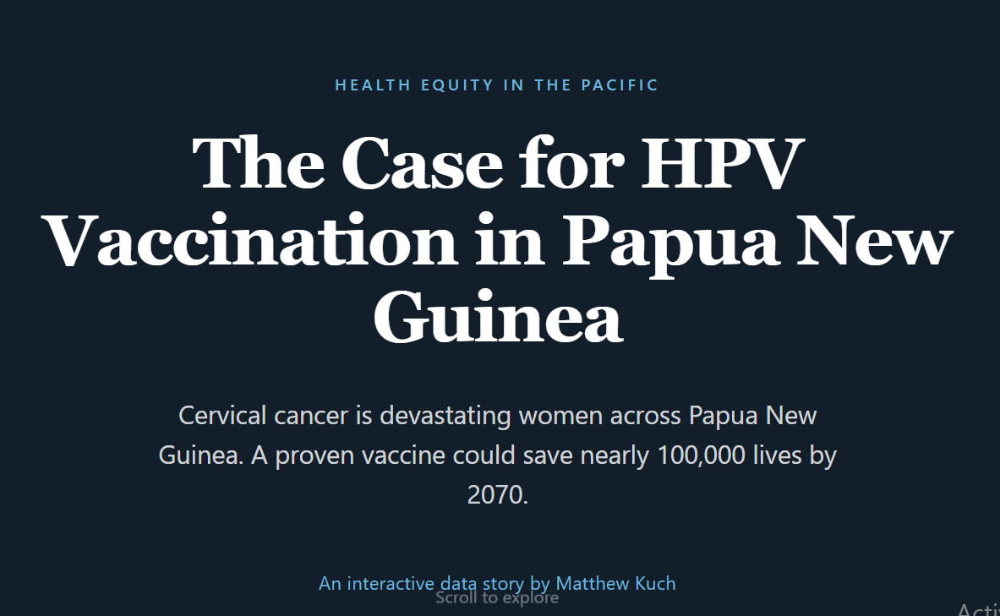

Today is **International HPV Awareness Day**, and to mark this important day I wanted to share a data-visualization story from a project I worked on last year in Papua New Guinea.

➡️ **Explore the interactive data story:** <https://bk-advisors.github.io/hpv-png-story/>
