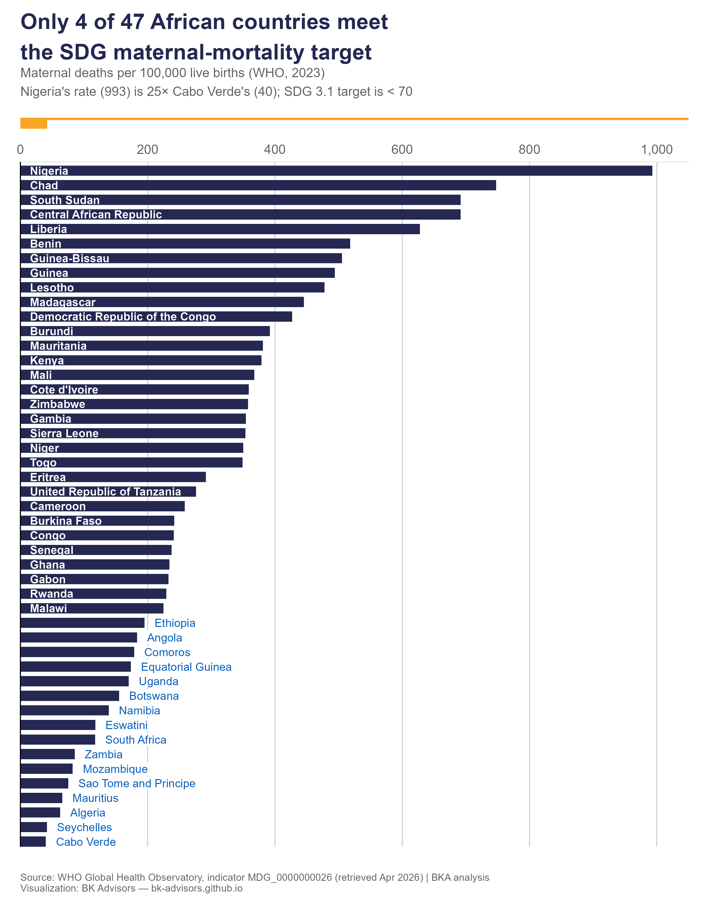

In 2023, a woman giving birth in Nigeria was 25 times more likely to die than one giving birth in Cabo Verde.

Both are African countries, albeit of different sizes, but the gap is still staggering.

The Sustainable Development Goal 3.1 sets a clear target: fewer than 70 maternal deaths per 100,000 live births by 2030.

Today, only 4 of 47 African countries meet that target — Cabo Verde (40), Seychelles (42), Algeria (62), and Mauritius (66).

Meanwhile, Nigeria (993), Chad (748), South Sudan (692), and the Central African Republic (692) report rates that Europe last saw a century ago.

Maternal mortality isn't a mystery. We know what works and can save lives: skilled birth attendants, emergency obstetric care, family planning, and the political and financial commitment to deliver them consistently. The four countries that have crossed the SDG line built systems around exactly these basics.

➡️ **Explore the interactive chart:** <https://bk-advisors.github.io/africa-mmr/> — it makes the disparity impossible to look away from.

The [Beginnings Fund](https://www.linkedin.com/company/beginnings-fund/) (<https://beginningsfund.org/>) and others are doing something about this. No mother should die giving life.
