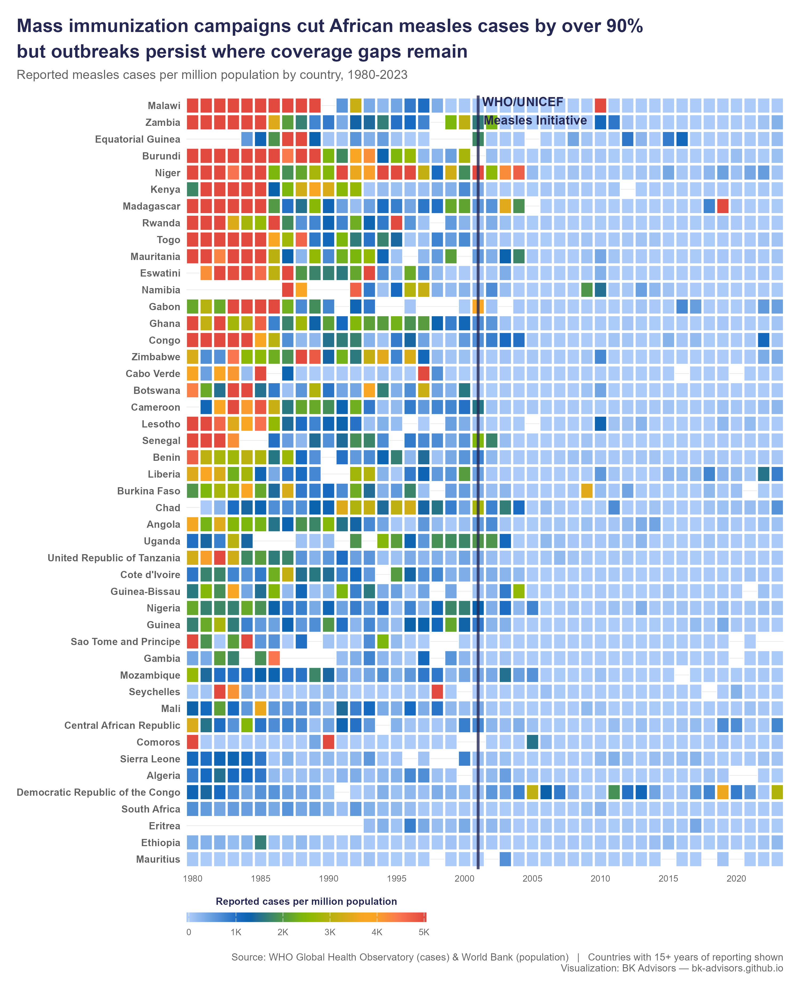

In 1981, measles infected 1.4 million people across Africa in a single year.

By 2016, that number was 35,000. A 97% drop.

What happened? The WHO/UNICEF Measles Initiative launched mass immunization campaigns starting in 2001.

Countries that used to see thousands of cases per million people (e.g. Malawi, Zambia, Niger, Kenya) saw their numbers collapse within a few years.

It's one of the most dramatic public health achievements of the last half century. But it's hard to appreciate something you can no longer see.

That's why I built this interactive heatmap. 44 years, 46 countries. You can watch the red tiles fade to blue, country by country, year by year. It makes the invisible visible.

➡️ **Explore the interactive chart:** <https://bk-advisors.github.io/africa-measles/>
