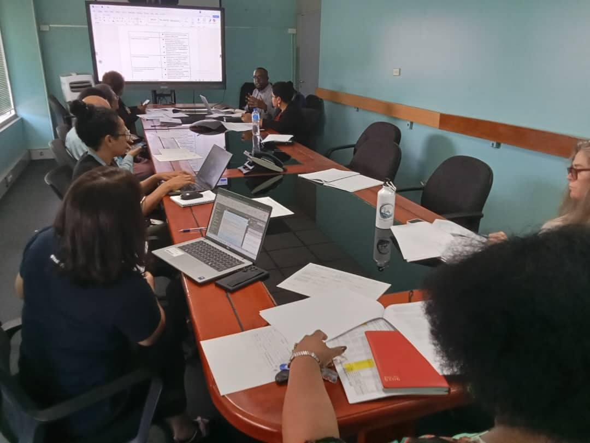
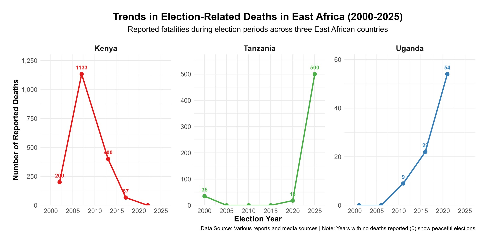

## When politics sets the health calendar

For most of 2025, I have been in meeting rooms in Papua New Guinea talking about a vaccine that many Ugandans have now almost taken for granted: HPV.

PNG has one of the highest cervical cancer burdens in the Asia Pacific region. Recent estimates suggest around 1,053 women are diagnosed with cervical cancer every year and roughly 650 die, in a country with a much smaller population than Uganda. That is like wiping out several extended families every year.

The evidence is strong that HPV vaccination, combined with screening and treatment, can prevent a large share of these deaths over the coming decades. Statistical modelling shows that scaling up HPV vaccination and cervical screening in countries like PNG could avert tens of thousands of deaths in the long term.

The science is clear. One of the stumbling blocks, in this case, is general elections.

A senior health leader in PNG told us very calmly in one planning meeting: if the national HPV campaign does not happen in 2026, it will be extremely difficult to run it in 2027 because of the general elections and the tribal tensions that usually follow. In her view, the next realistic window might only be three years later.

In practice, this means an entire cohort of girls could pass through adolescence without getting the vaccine on time. Since HPV vaccination is most effective before sexual debut, those missed years translate into a permanently higher lifetime risk of cervical cancer for that group.

That experience in PNG made something click for me. Elections are not just moments when our political leaders change (or not). They quietly decide who lives long enough to see those leaders govern.

## Elections as public health events

If you zoom out from PNG and Uganda and look at the wider literature, a pattern starts to appear. Whenever there is serious political unrest or conflict, routine health services tend to suffer. This is the underlying thesis for this article, which is backed by systematic reviews of conflict settings that show drops in vaccination coverage and increases in vaccine preventable disease outbreaks when insecurity disrupts outreach and facility services.

Uganda is not in a civil war, but our elections bring their own version of instability. The 2021 elections were described by Human Rights Watch as marred by killings, beatings of opposition supporters, arbitrary arrests and an internet shutdown. Even the Afrobarometer 2025 survey reports that close to half of Ugandans fear intimidation or violence during elections, and many worry about the role of security forces.

Our neighbors have similar stories. The post election crisis in Kenya in 2007 and 2008 left around 1,133 people dead and orders of magnitude more displaced from their homes. The more recent election violence in Tanzania, also saw a reported 500 people killed. Elections can be scheduled on a calendar, but the human consequences spill out for years.

With that backdrop, let me unpack three ways elections show up as a public health issue: in lives lost, in disrupted care and in frozen policy.

## 1. Lives lost and mental health scars

The most visible cost is the people who never come back home.

In Uganda, at least 54 people were killed in November 2020 when security forces cracked down on protests after the arrest of opposition politician Bobi Wine. Those numbers are not abstract to families who buried loved ones. Add on other incidents around campaigns and polling days, and elections start to look like a recurring risk factor for young men in particular.

What we rarely talk about is the mental health side. Exposure to political violence, even if you are not physically injured, is linked in many studies to higher rates of anxiety, depression and post traumatic stress symptoms. Children who see their parents beaten or arrested do not simply "move on". Their sense of safety in the world shrinks.

Uganda already has a large unmet need for mental health care, with few specialists and limited services outside a handful of facilities. Election related violence adds one more layer to that backlog.

## 2. Disrupted access and broken supply chains

Even when bullets are not flying, fear changes behavior. In the run up to tense elections, people often stay home more. They avoid being out at night. They delay any trip that feels optional. In health terms, that matters.

I sometimes imagine an expectant mother in the more rural parts of my home district of Wakiso. She has been advised to deliver at a facility, but her due date is close to the election and there are rumors of roadblocks and protests on her road. She weighs the risk of travelling while there might be protests or tear gas against the risk of staying home. That is a public health decision shaped almost entirely by politics.

We know from other settings that insecurity is associated with reduced facility visits, lower vaccination uptake and interruptions in chronic disease treatment. Uganda saw similar dynamics when Covid related enforcement operations turned violent, including beatings and shootings by security forces. The message many people heard was simple: being outside can be dangerous.

On top of that, staff may struggle to reach facilities when transport is disrupted or when they themselves fear being caught in violence. Supply trucks can be delayed if major roads are blocked or if security operations intensify. A two week delay in ARVs or TB drugs can have lifelong consequences for patients.

## 3. Policy paralysis and budget drift

The third impact feels more technical, but it is very real.

Big health reforms and campaigns rely on long, boring, bureaucratic work: drafting guidelines, costing plans, pushing procurement, negotiating budget lines. Election seasons interrupt that slow grind. Officials become cautious. Difficult decisions get postponed. New initiatives are quietly shifted to "after elections".

You can see this in PNG, where planners worry that a national HPV rollout will not be feasible in the same year as general elections. Modelling suggests that delaying HPV vaccination by several years can significantly reduce the number of cervical cancer deaths averted by 2070 and beyond. That is what a policy pause looks like in health terms: a flatter line on the "deaths prevented" graph.

Budgets can also drift. Election years often see more money and attention move toward security and highly visible infrastructure. Analyses of electoral violence in Uganda describe it as a recurring threat to human security that shapes how the state deploys its resources. Each shilling moved away from essential medicines or health workers is a choice, even if it is never debated in public.

## Why "Being Apolitical" is hard when you care about public health

So what does this mean for someone like my niece, or for you reading this?

You do not have to attend rallies or wear party colors to be involved in politics. If you care about whether an ambulance can reach your home during unrest, or whether your child gets a vaccine on time, you are already in the political conversation, whether you like it or not.

Elections influence:

- How safe it feels to move to a health facility.
- Whether critical campaigns, like HPV or polio, go ahead on schedule.
- How budgets are divided between treating disease and controlling dissent.

Being "apolitical" in that context often just means being silent about decisions that still shape your health.

That does not mean everyone must turn into a full time activist. It can simply mean asking different questions. When parties and candidates come to your community, you can ask how they plan to keep health workers and patients safe during campaigns. You can ask what safeguards exist to prevent budget cuts to health in election years. You can insist that peaceful elections are part of a healthy society, not an optional extra.

My hope for Uganda in January 2026 is simple. I want an election where hospitals remain functional, where health centers stay open without fear, and where children can look at a red roof and see only paint, not a threat.

Happy holidays everyone and stay safe.

## Notes & References

- <https://hpvcentre.net/statistics/reports/PNG.pdf>
- <https://www.cfr.org/report/electoral-violence-kenya>
- <https://www.hrw.org/news/2021/01/21/uganda-elections-marred-violence>
- <https://www.bbc.com/news/articles/cz0x8vdvkjgo>
