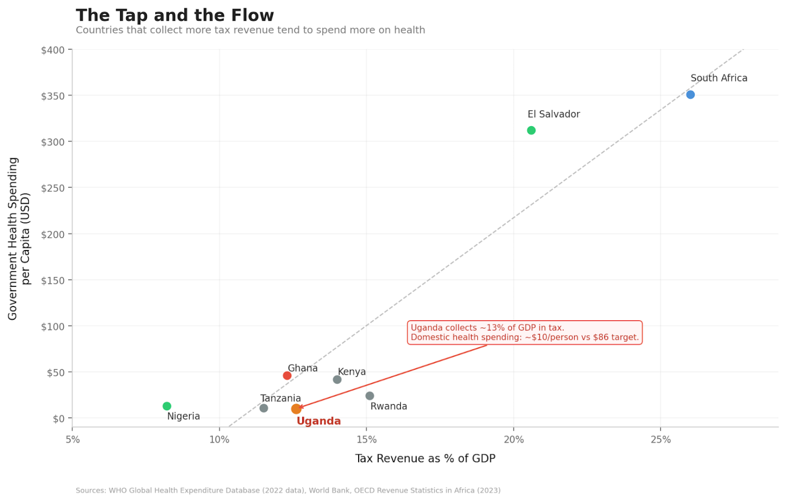

There is a woman I buy fruit from, almost every week. She operates from a small wooden stand near my home, and she has been there for as long as I can remember. Mangoes in season, watermelon when it's hot, jackfruit when she can find it. She knows my order before I say it.

One afternoon, I asked her – half-curious, half-making conversation – whether she pays any tax. She laughed so hard she nearly knocked over a pile of passion fruits. "Tax?" she said, still grinning. "For what? When my child gets sick, I take her to the health center and there's no medicine. The road outside has had the same pothole since last year. So what exactly am I paying for?"

I didn't have a good answer.

Her question has stayed with me because it captures something at the core of Uganda's fiscal problem: a broken social contract. Citizens see no tangible return from their taxes, so they resist paying. The government collects too little, so it can't deliver. And the cycle repeats.

As I've written this series on health financing, I've kept circling back to one question: of all the factors that determine how much a government spends on health – aid, debt, corruption, elections, inequality – which one matters most?

The answer, when you look at the research, is surprisingly clear. It's tax revenue.

## The 80/20 Rule of Health Spending

If you had to pick one factor that predicts how much a government spends on health, the research points in the same direction almost every time: domestic fiscal capacity. In plain terms, that means how much tax a country can collect.

The logic is almost too simple to feel like an insight. Health spending is recurrent. Doctors need salaries every month. Drug shelves need restocking every quarter. Facilities need maintenance every year. You cannot sustain these with volatile donor aid or one-off windfalls. You need predictable, domestic, recurring money. And the main source of that is taxation.

I find it useful to think of it as a plumbing problem. Tax revenue is the tap. Budget allocations, the Abuja Declaration targets, donor pledges – those are the buckets. You can arrange the buckets however you like, but if the tap is barely running, they won't fill.

Countries at similar income levels but with different tax effort show very different health spending trajectories. Long-run increases in government health expenditure track tax revenue growth, not aid flows. When you apply an 80/20 lens to the factors behind government health spending, fiscal capacity accounts for the bulk. Everything else – institutions, aid, debt, election cycles, demographics – mostly operates through, around, or in the shadow of that one constraint.

## Uganda's Anemic Tap

So how is Uganda's tap running? Barely.

Uganda's tax-to-GDP ratio has been stuck at around 12–13% for years, below the sub-Saharan African average and well short of the government's own targets. For every shilling of economic activity in this country, the government collects roughly 13 cents. The rest stays in the informal economy, slips through exemptions, or simply isn't captured.

The downstream numbers are predictable. Uganda's government health spending sits at roughly \$23 per person per year (per UNICEF budget analysis; the WHO estimates domestic government health spending at approximately \$10 per capita), against a benchmark target of \$86. The health budget hovers around 7.7% of the national budget – half of the 15% we committed to under the Abuja Declaration in 2001. As I wrote in my first article in this series, government health spending per person has barely moved in a decade, while Kenya and Rwanda have pulled further and further ahead.

And here's the detail that should stop us all. According to UNICEF's budget analysis, Uganda foregoes an estimated UGX 2.881 trillion in tax revenue every single year through exemptions, allowances, rate reliefs, and deferrals. The government is choosing not to collect this money. For context, the entire approved health budget for FY 2024/25 was UGX 2.946 trillion. We are leaving almost an entire year's health budget on the table, uncollected.

Pile on the fact that atleast 54% of Uganda's economy operates informally – largely outside the tax net – and the picture becomes clearer. The tap is barely open.

## An African Giant Turns the Tap?

While Uganda has been standing still on this, Nigeria has started moving.

In June 2025, President Bola Tinubu signed four tax reform bills into law: the Nigeria Tax Act, the Nigeria Tax Administration Act, the Nigeria Revenue Service Act, and the Joint Revenue Board Act. The ambition is to push Nigeria's tax-to-GDP ratio to 18% over the medium term – a big jump for a country that, like us, has historically collected far too little.

What makes the Nigerian reforms interesting is how they try to protect the poor while expanding the base. Small businesses below a certain turnover threshold are exempt from corporate income tax, VAT, and withholding tax. Essential goods – food, healthcare, education – are exempt from VAT. And the share of VAT revenue going to states rose from 50% to 55%, which matters because states are where most health services actually get delivered.

Nigeria Health Watch pointed out that this expanded fiscal space gives state governments a real opportunity to invest in publicly funded health coverage. They also added a warning: "the fiscal space created by these tax reforms will not remain open forever." Debt obligations and shifting political priorities will compete for every new naira.

Nigeria's reforms have problems of their own, and implementation will be messy. But the underlying principle is sound: widen the tax base, shield the vulnerable, and deliberately channel new revenue toward social services.

The lesson for Uganda is that this lever exists, and other countries are pulling it. El Salvador offers an even more dramatic example. Between the 1990s and 2015, the country doubled its tax-to-GDP ratio from 8% to 16% and deliberately pushed the new revenue into health. Out-of-pocket health spending fell from 60% to below 30%. Under-five mortality dropped from 53 to 10 per 1,000 live births. That is what happens when you actually open the tap.

## What Can We Do?

If tax revenue is the dominant driver of health spending, then this is where the effort has to concentrate. Three things come to mind:

### 1. Broaden the tax base without crushing the poor

Uganda's informal economy is enormous – 54% of GDP – and mostly untaxed. Bringing more of it into the tax net is necessary, but it has to be done with care. Digitize tax systems. Simplify compliance for small and medium enterprises. Reduce the bureaucratic maze that discourages people from even trying. And critically, protect essential goods from tax – food, healthcare, education – so that widening the base does not mean widening the burden on those who can least carry it. Nigeria's approach on this is worth watching.

### 2. Earmark a share of new revenue for health

Collecting more is only half the problem. The other half is making sure health gets its fair share. Uganda has broken its Abuja Declaration commitment for over twenty years. One mechanism to change that is earmarking: dedicate a specific portion of new tax revenue to health, as a floor, not a ceiling. This creates a direct and visible link between revenue growth and health investment. It also makes it harder for competing priorities to quietly eat the gains, which is what tends to happen when allocation decisions are left entirely to political discretion.

### 3. Rebuild the social contract

This is probably the hardest part, and the most important. My fruit vendor has no reason to pay tax if she never sees what it buys. Citizens need to see tangible improvements from the money they contribute – medicine on the shelves, health workers who are actually present, roads that don't swallow motorcycles. This is a trust problem as much as it is a collection problem. And trust gets rebuilt one visible improvement at a time.

A UN dialogue on domestic resource mobilization in Uganda identified low public confidence in how government uses funds as one of the biggest barriers to tax compliance. That finding should surprise nobody. Fixing the confidence gap is as urgent as fixing the tax code itself.

## The Root of the Root

Over these past months, I've been writing about why Uganda and much of Africa underinvests in health. Donor displacement. Debt. Corruption. Inequality. Elections. Each piece of the puzzle is real, and each one matters.

But the more I dig into this, the more I see that they are all branches of the same tree. And the root of that tree is fiscal capacity – how much money the government can actually raise from its own citizens and its own economy. If the tap is dry, it doesn't much matter how cleverly you arrange the buckets.

If we get taxation right – broaden the base, protect the poor, direct revenue to health, and give citizens a reason to trust the system – we lay the foundation for everything else. If we don't, we will keep circling the same problems, decade after decade, with slightly different labels.

The woman who sells me fruit every week doesn't need a lecture on fiscal policy. She needs a deal that makes sense: you put something in, and something comes back. A clinic that has medicine. A nurse who shows up. A road without a crater.

Until we can offer her that deal, the tap stays dry, and the buckets stay empty.

## Notes & References

1.  World Bank, 2025. *Uganda Economic Update: Increasing Uganda's Fiscal Space through Improved Revenue Mobilization*. Available at: <https://www.worldbank.org/en/country/uganda/publication/increasing-uganda-s-fiscal-space-through-improved-revenue-mobilization-and-enhanced-efficiency-of-spending-and-service-d>
2.  UNICEF, 2024. *Uganda Health Sector Budget Brief 2024/25*. Available at: <https://www.unicef.org/esa/media/13261/file/UNICEF-Uganda-Health-Budget-Brief-2023-2024.pdf>
3.  UNICEF, 2025. *Health Sector Financing: Analysis and Strategic Recommendations (FY2025/26)*. Available at: <https://www.unicef.org/uganda/media/20426/file/2025-2026%20Health%20Sector%20Budget%20Brief.pdf>
4.  United Nations Uganda, 2025. *Leveraging Domestic Resource Mobilization as a Cornerstone of Uganda's Sustainable Development Path*. Available at: <https://uganda.un.org/en/296986-leveraging-domestic-resource-mobilization-cornerstone-ugandas-sustainable-development-path>
5.  Nigeria Health Watch, 2025. *Will the 2025 Tax Reform Deliver for Nigeria's Health System?* Available at: <https://articles.nigeriahealthwatch.com/will-the-2025-tax-reform-deliver-for-nigerias-health-system-it-depends-on-how-governments-and-the-rest-of-us-respond/>
6.  PwC Nigeria, 2025. *The Nigerian Tax Reform Acts*. Available at: <https://www.pwc.com/ng/en/publications/the-nigerian-tax-reform-acts.html>
7.  WHO, 2024. *Global Health Expenditure Database*. Available at: <https://apps.who.int/nha/database>
8.  WHO, 2023. *Health Financing Progress Matrix Assessment: Uganda*. Available at: <https://library.health.go.ug/sites/default/files/resources/WHO%20HFPM%20Uganda%20FINAL.pdf>
