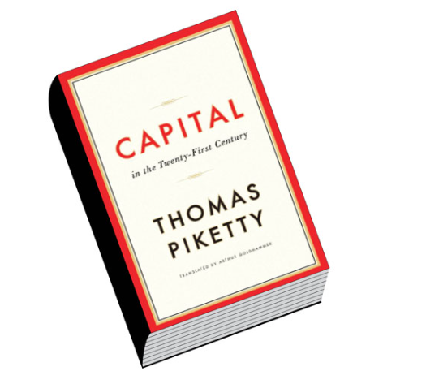
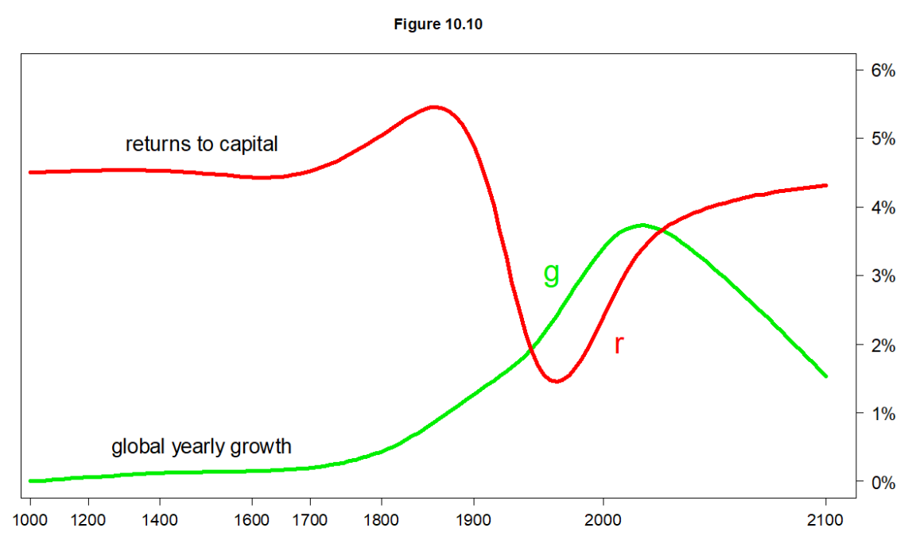
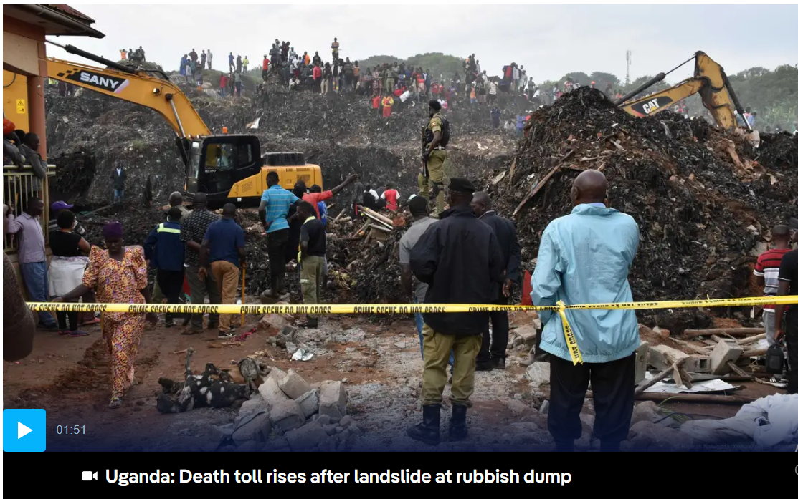

There's a well-known line in the Gospel of Matthew (The Parable of The Talents) that reads:

> *"For unto everyone who has, more will be given, and he will have an abundance. But from him who has not, even what he has will be taken away." — Matthew 25:29*

I don't mean to start this post with a sermon, but it's a verse that runs through my head constantly as I write about topics I care about, especially: the need to direct more impact investments toward the social sector.

I reflect on this passage because it so accurately describes a core feature of our world: how wealth, power, and opportunity gradually concentrate in the hands of a few ("the haves"), often leaving the majority (the "have-nots") perpetually behind, through arguably and in many cases, no fault of their own.

And it's not an accident - it's a feature of our current financial and economic system that is designed to concentrate extreme wealth in the hands of a few. In this post, I want to explore why this happens and what the broader implications are.

## Cumulative Advantage

One of the best books I've read on this is "Capital in the 21st Century" by French economist Thomas Piketty. His core thesis, backed by extensive historical data, reveals two key points:

1.  The Rate of Return on Capital (R) - the money generated by owning assets like stocks in companies, government bonds/T-bills, and real estate - has consistently outpaced...

2.  ...the Rate of Economic Growth (g) - the growth of the wider economy, which dictates wage increases for most people.

In short, Piketty's famous formula is R > g.

This simple inequality equation is the engine driving the widening wealth gap.

Like many in my network, you are probably on the "have" side of this equation. You likely possess assets, forms of "Capital", such as a university education, real estate, investment portfolios, or even strong professional connections. These assets tend to grow, accumulate, and compound over time, steadily increasing your wealth.

However, for those who do not own such capital, their primary path to a better income is through wages, which are tied to economic growth (g). When 'g' stagnates at 3-5% per year while 'R' compounds at a higher rate (e.g. 10+%), you can visualize the widening gap.

That is the Matthew Effect in action: wealth breeding more wealth for a few.

Like I've shared with many friends and family, this growing inequality isn't just an inconvenient trend; it's a ticking time bomb of civil unrest that, if not rebalanced, threatens everyone's wellbeing.

## The Reverse Matthew Effect

But there's a second, more devastating part to that verse: *"...from him who has not, even what he has will be taken away."*

This is the reverse effect, and it describes the profound vulnerability of those on the "have-not" side of the equation.

I'm reminded of the tragedy that occurred at the Kiteezi landfill here in Kampala, last year, where a collapse of the waste dump tragically killed over 30 people.

Let's think about this in the context of the Matthew Effect. These individuals were the definition of "him who has not." They possessed almost no financial capital. What little they "had" was their physical presence, their proximity to a meager livelihood (scavenging recyclable materials), and, in the most basic sense, their lives.

The system they existed in was not only failing to provide them with opportunities (the 'g' in Piketty's formula) but was actively dangerous. When the landfill collapsed, the system didn't just fail them; it took away everything - even the little they had.

This is a cumulative dis-advantage. It's not just that the poor get left behind; it's that they are disproportionately exposed to systemic shocks like environmental disasters, health crises, and economic downturns. They have no "capital" to buffer them from catastrophe. When a crisis hits, it doesn't just halt their progress; it erases it, sending them tumbling backward, often irretrievably.

## Rebalancing the Equation

This brings me back to why I write these articles. Our current system, as described by the Matthew Effect (R > g), excels at creating and compounding private wealth. It is, by its very design, incapable of solving the problems of the "have-nots" or protecting them from the "Reverse Matthew Effect."

Waiting for economic growth (g) to "trickle down" is not a solution; it's a passive acceptance of the gap.

This is where the social sector and impact investing become critical. They are not charity in the old-fashioned sense. They are a tool for rebalancing.

Directing capital to social enterprises, non-profits, and community initiatives is a conscious choice to build buffers for the vulnerable. It's about investing in resilience, creating opportunity where the market tends to see none, and building systems (like better housing, better education, and access to healthcare) that can potentially prevent tragedies like Kiteezi from re-occuring.

Governments must also adopt a more progressive tax policy to curb extreme wealth concentration and increase revenues to allocate more domestic investment into the social sector.

We, "the haves," cannot insulate ourselves from the consequences of a world defined by this stark divide. Rebalancing the system isn't just an act of compassion, it's really an act of collective survival. It is the only way to defuse the ticking time bomb and build an economy and systems that offers true abundance, not just for a few, but for all.

*"...to whom much is given, much is expected." — Luke 12:48.*

## Notes & References

- Piketty, Thomas. *Capital in the Twenty-First Century*. Translated by Arthur Goldhammer, Belknap Press, 2017.
- <https://www.dw.com/en/uganda-learns-hard-lessons-from-fatal-garbage-landslide/a-69995224>
- <https://pudding.cool/2022/12/yard-sale/> — a fascinating visual essay describing the same idea
- <https://en.wikipedia.org/wiki/Capital_in_the_Twenty-First_Century>
- It's not lost on me, as I wrote this piece, that my name is "Matthew", so maybe I have to provide a disclaimer, haha — I have no direct relation to this Effect…
